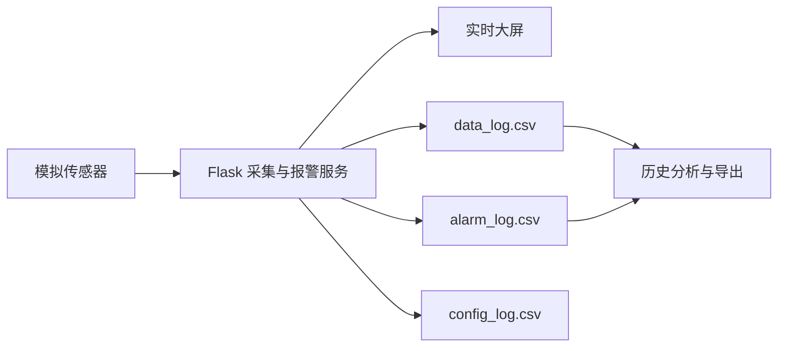

# 桥体卫士——桥梁结构健康监测系统

面向桥梁应变监测场景的 Flask Web 系统。系统持续采集模拟应变数据，在超限时进行分级报警，并提供历史查询、数据分析和 CSV 导出功能。

## 功能

- 主画面实时显示应变值、采集周期、报警阈值、运行状态和趋势曲线。
- 支持预警、报警、严重报警三级异常提示，并可确认处理当前报警。
- 支持设置报警阈值和采集周期；每次变更写入 `config_log.csv`，服务重启后自动恢复最近一次有效设置。
- 支持按完整历史数据的时间段查询报警和监测数据，展示统计对比并导出 CSV。
- 支持一键清除数据或报警，操作前会明确提示同时清除对应 CSV 历史记录。

## 系统架构

## 运行

1. 安装 Python 3 和 Flask：`pip install flask`
2. 在项目目录运行：`python app.py`
3. 浏览器访问：`http://127.0.0.1:5000`
4. 默认账号为 `admin`，密码为 `123456`。

## 比赛演示顺序

1. 登录后展示大屏的实时应变、采集状态和仪表盘。
2. 打开“设置”，修改采集周期和阈值，返回大屏说明参数已立即生效。
3. 等待或展示模拟数据超过阈值，说明分级报警；点击“确认处理”后，主画面和历史报警记录均显示已处理。
4. 进入“历史记录”，按时间筛选数据，展示统计结果、趋势图和 CSV 导出。
5. 演示清除操作的二次确认提示，并说明历史文件同步清空。

## 扩展方向

当前数据源为模拟器。对接真实设备时，只需将 `Simulator._loop()` 中的随机数据替换为串口、Modbus、MQTT 或 HTTP 传感器数据读取逻辑，保持后续报警、存储和展示接口不变。
